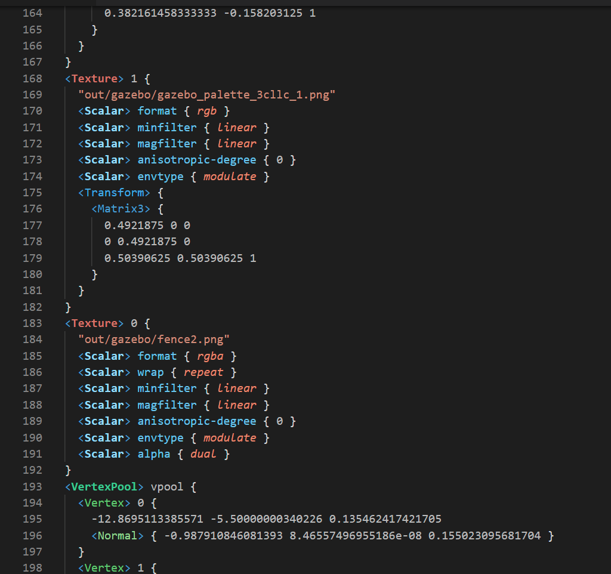

# Panda3D EGG Syntax VSCode Extension

I personally made this plugin for myself since I was tired of seeing solid-white text when working with Panda3D Egg files.

This is an incomplete plugin, but development for improving this plugin is still planned.

## Features

* Adds Egg file/syntax support into VSCode
* Egg syntax is now colorful!

## Installation
The method of installing this plugin right now is currently hacky, probably because I used the wrong method of recoloring keywords. That being said, when installing the plugin for the first time, you may not see much change with the egg file. This plugin is currently considered as a *theme*. You shouldn't apply this theme (globally) since it's not meant to be an actual universal theme.

You will need to configure this theme to apply for only EGG files via Jsaulou's "theme by language" VSCode extension, which is listed as a dependency for this plugin.

It does kind of suck that you have to do this, but I already spent a couple hours trying to integrate semantic highlighting. It didn't work out, so I just resorted to making a theme (couldn't find another way lol).

# Project Timeline
As of this writing, this plugin lacks many crucial features to further integrate EGG workflows with VSCode. That being said, here is a list of features that would be nice for this plugin to eventually have:

* Type hinting for certain egg attributes, such as ``<Scalar> alpha { X }``
* Ability to compile bamfiles inside of vscode
* Other panda3d things.
* Also fix up this readme. Could be written better but I am too busy to do so at the very moment.